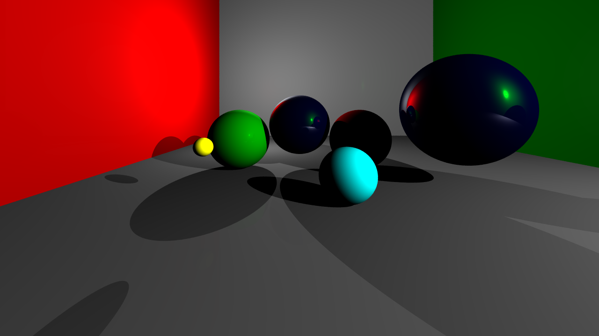

# Introduction

This is my first raytracer.

Only capable of rendering Spheres and Planes.




# Compile me

I assume that you already have installed a decent version of **CMake** and **Git** on your computer.

## Install dependency libraries
You need to install the following dependencies:
- [Google Test](https://github.com/google/googletest)
- [Google Bench](https://github.com/google/benchmark)

You can either follow the official tutorials, or abruptly copy/paste the following into your terminal:

```bash
git clone https://github.com/google/benchmark.git
git clone https://github.com/google/googletest.git benchmark/googletest
cd benchmark
mkdir build && cd build
cmake ../ -DBENCHMARK_DOWNLOAD_DEPENDENCIES=ON
make -j 8
sudo make install
```

## Project compilation

```bash
mkdir build && cd build
cmake ../ -DCMAKE_BUILD_TYPE=Release
make -j 8
```

## Run

- Run the **benchmark**: `./build/bench/bench`
- Run the project: `./build/src/raytracer`

# To Fix:

- the maths behind the camera's virtual screen are broken

# Conclusion

There's nothing crazy here, just my first steps to the 3D world.
